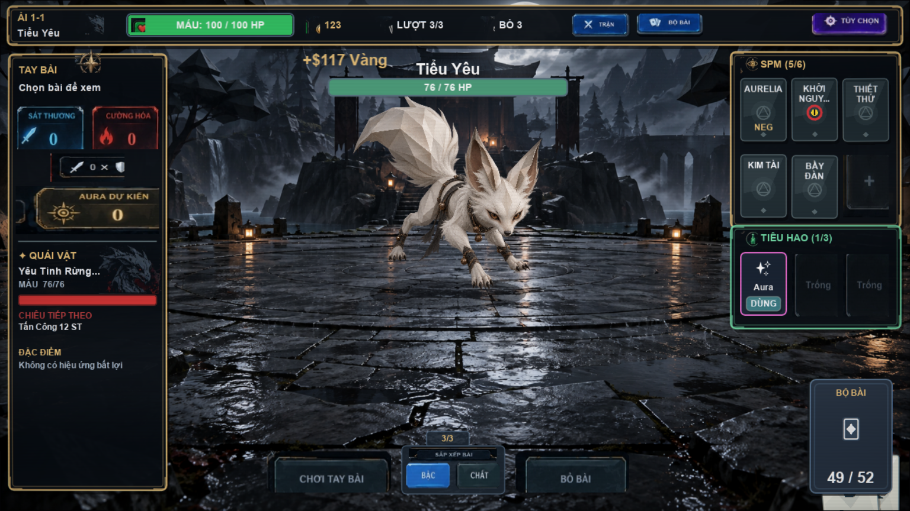
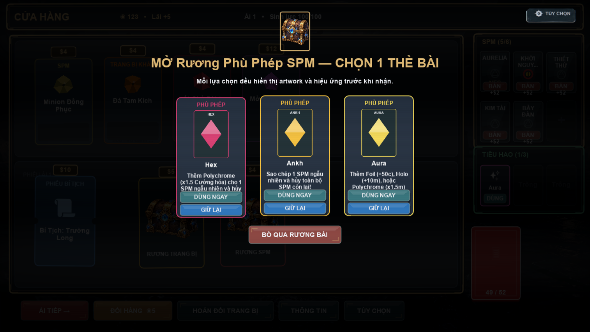
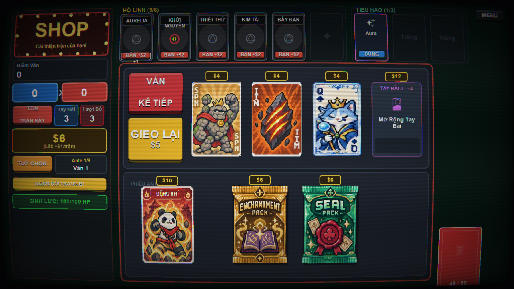
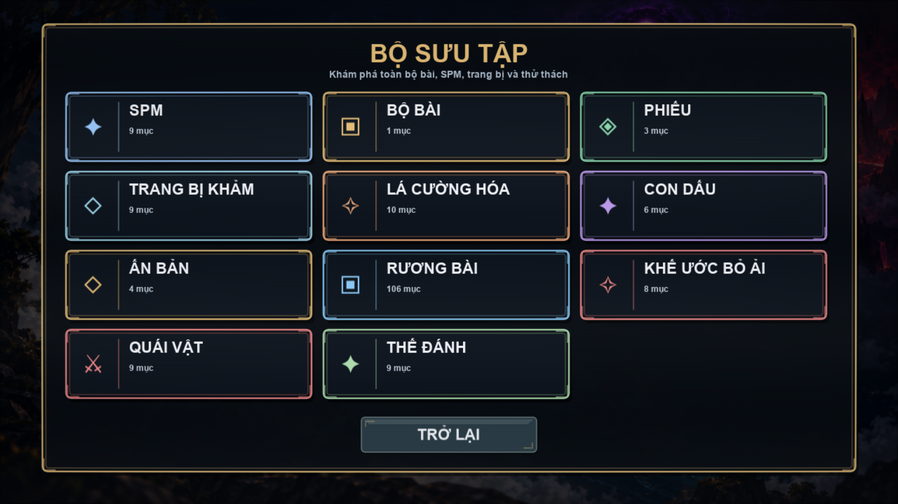
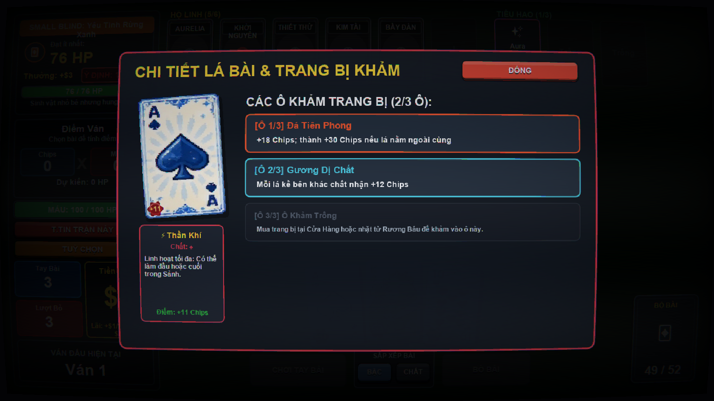
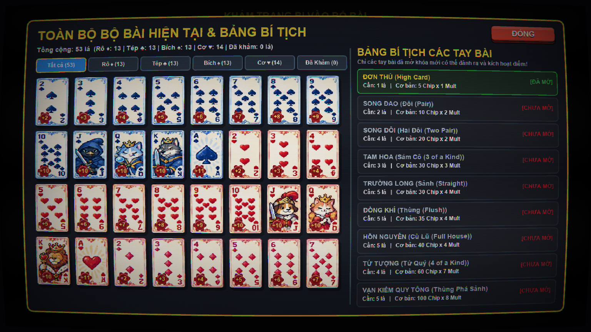

# 🃏 LUA.TCG — GRIMDARK POKER ROGUELIKE DECKBUILDER

> Một tựa game thẻ bài chiến thuật Poker Roguelike Deck-building phong cách Grimdark kỳ bí, kết hợp cơ chế tính điểm của Balatro, chiến đấu theo lượt kiểu Slay the Spire, **Bộ Bài Đỏ khởi đầu**, **Thứ Bậc Quân Chủng**, **Khảm 5 Hốc Đá Quý**, 25 **Thần Hộ Mệnh** và hệ thống vật phẩm tiêu hao.
>
> Toàn bộ trò chơi được kiến tạo 100% bằng **Lua thuần túy** và vận hành mượt mà trên nền tảng **LÖVE 2D (Love2D v11.5)**.

---

## 📸 Thư Viện Hình Ảnh Trực Quan (Gameplay Showcase)

| Chiến Đấu Theo Lượt & Bùng Nổ Điểm Số | Cửa Hàng & Gói Thẻ ("Dùng Ngay / Giữ Lại") |
| :---: | :---: |
|  |  |
| *Giao diện chiến đấu Grimdark, hiển thị Intent quái, thanh Hộ Mệnh & 2 ô Tiêu Hao* | *Mở Gói Booster: Lựa chọn "DÙNG NGAY" hoặc "GIỮ LẠI" vào ô Tiêu Hao* |

| Cửa Hàng Lữ Khách & Phiếu Đặc Quyền | Bộ Sưu Tập Toàn Thư (Compendium) |
| :---: | :---: |
|  |  |
| *Cửa hàng Balatro: Hàng hóa, Voucher, Booster Packs & Reroll ($5 -> $6 -> reset $5)* | *Toàn thư 11 danh mục tra cứu Thần Bài, Phù Chú, Dấu Ấn, Thế Bài & Dị Biến* |

| Soi Chi Tiết Quân Vụ & 5 Hốc Khảm Đá Quý | Toàn Bộ Bộ Bài (Deck Viewer [Tab]) |
| :---: | :---: |
|  |  |
| *Chuột phải soi chi tiết cấp bậc Quân chủng, chất bài & 5 hốc khảm bảo ngọc* | *Bấm Tab xem tỷ lệ 4 chất, thẻ bài đã khảm ngọc và bí kíp đã mở khóa* |

---

## 📜 Giấy Phép & Bản Quyền (License)

Dự án phát hành dưới giấy phép mã nguồn mở **MIT License**. Bạn có quyền tự do sử dụng, nghiên cứu, sửa đổi và phân phối theo quy định của giấy phép.

*Chúc bạn có những trải nghiệm chiến thuật đỉnh cao, nặn bài bùng nổ và chinh phục thành công cả 8 Ante của LUA.TCG!*
