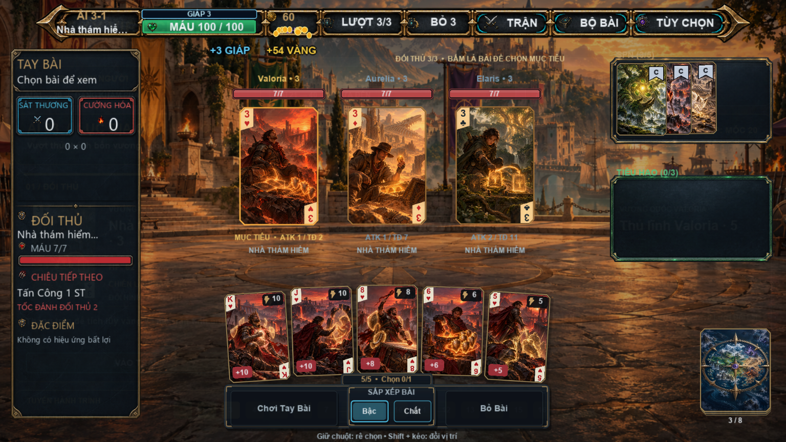
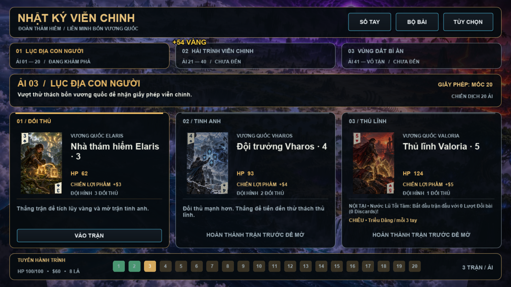
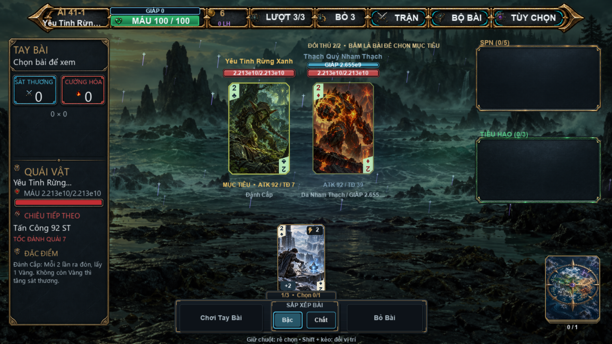
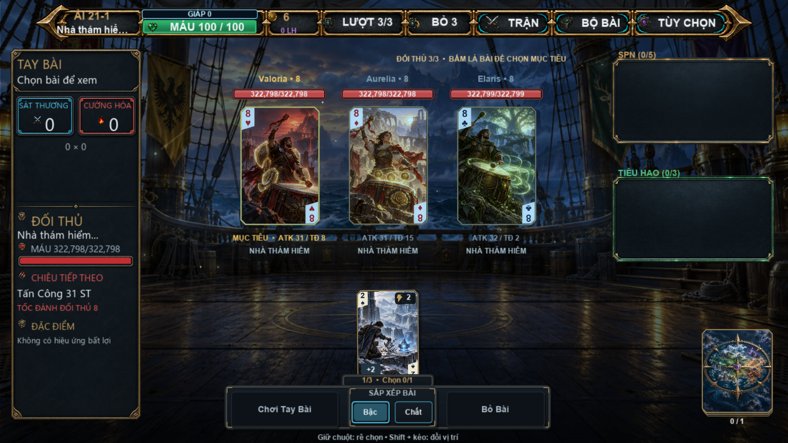
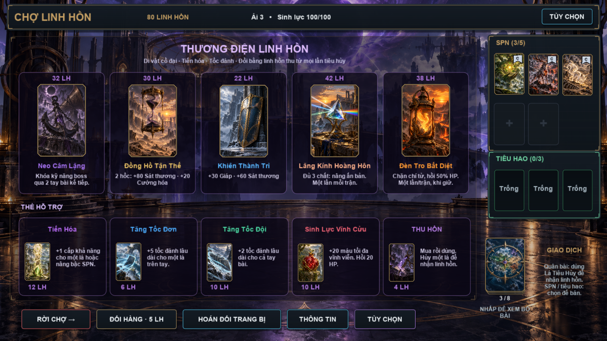
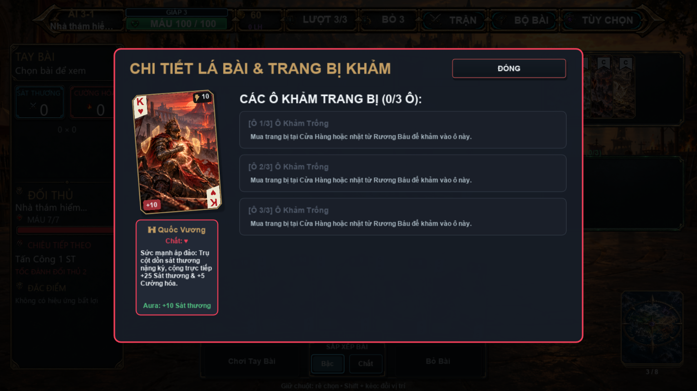
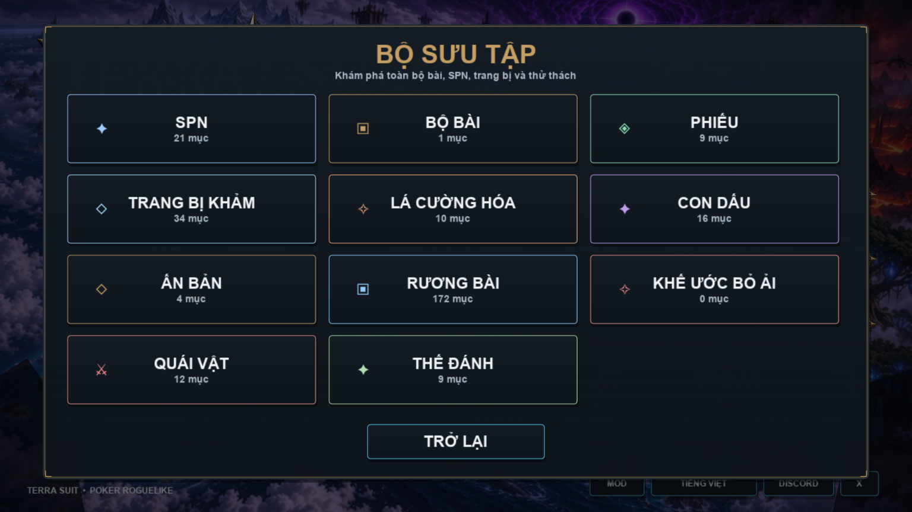

# 🃏 LUA.TCG — Poker Roguelike

**Phiên bản 0.75.3** · Lua / LuaJIT · LÖVE 11.5 · [MIT](LICENSE)

Game thẻ bài roguelike kết hợp thế bài Poker, xây dựng bộ bài và chiến đấu theo lượt. Từ bốn vương quốc trên lục địa, bạn giành giấy phép viễn chinh, lên tàu và khám phá vùng đất bí ẩn trong thế giới fantasy phương Tây.

## 📥 Tải về và chơi

- **Windows 64-bit:** vào [Releases](https://github.com/UIBreaker/Lua.TCG.New/releases/latest), tải `LUA-TCG-0.75.3-Windows-x64.zip`, giải nén toàn bộ rồi mở `LUA-TCG.exe`. Không cần cài Lua/LÖVE.
- **Android và iPhone:** mở [trang chơi web](https://uibreaker.github.io/Lua.TCG.New/), xoay ngang máy và bấm **BẮT ĐẦU CHƠI**. Trang được xuất bản bằng GitHub Pages; cần triển khai thành công trước khi gửi link cho bạn bè.
- **Android có LÖVE 11.5:** tải `LUA-TCG-0.75.3-Mobile.love` trong Releases và mở bằng LÖVE. File `.love` không phải APK hay ứng dụng iPhone cài trực tiếp.

Trên điện thoại: chạm chọn, rê chọn nhiều, giữ 0,5 giây xem/dùng bài; bật **ĐỔI CHỖ** để kéo sắp xếp. Thanh nút lớn trên web giúp Đánh / Bỏ / xem Bộ bài / Quay lại. Save thuộc từng trình duyệt; xóa dữ liệu trang sẽ xóa save. Xem [ghi chú bản phát hành](docs/RELEASE_NOTES_0.75.3.md).

## 📸 Hình ảnh trực quan

Ảnh chụp mới từ game chạy bằng LÖVE, ngày **05/10/2026**. Một số màn dùng bộ bài và tài nguyên dựng sẵn trong chế độ capture để minh họa các tính năng về sau.



| Chọn ải viễn chinh | Khám phá vùng đất bí ẩn |
| :---: | :---: |
|  |  |

| Hải trình viễn chinh | Chợ linh hồn |
| :---: | :---: |
|  |  |

| Soi chi tiết lá bài | Bộ sưu tập |
| :---: | :---: |
|  |  |

## ✨ Tính năng hiện có

- **Khởi đầu nhỏ, xây bộ bài dần:** Bộ Bài Đỏ bắt đầu với **một quân bài ngẫu nhiên** trong bộ chuẩn 52 lá. Mua thêm quân bài, mở rộng tay bài và chọn nâng cấp theo chiến thuật.
- **9 thế bài Poker:** Mậu thầu, Đôi, Hai đôi, Sám cô, Sảnh, Thùng, Cù lũ, Tứ quý và Thùng phá sảnh. Khởi đầu mở Mậu thầu; Bí Tịch mở khóa thế bài, Hành Tinh tăng cấp thế bài. Có biến thể Sảnh 3 lá.
- **Tính điểm thành sát thương:** Kết hợp Chips (Sát thương), Mult (Cường hóa), XMult và các hiệu ứng Aura, sát thương bổ sung, Giáp, hồi máu hoặc Vàng. Thứ tự quân bài và SPN ảnh hưởng combo.
- **52 khả năng quân bài:** Bốn chất gắn với Valoria ♥, Aurelia ♦, Elaris ♣ và Vharos ♠; có kích hoạt khi đánh, giữ, bỏ hoặc tiêu hủy. Tiến hóa riêng từng quân bài từ **cấp 0–5**, xem trước thay đổi trước khi xác nhận; có nâng tốc đánh riêng lá hoặc cả đội.
- **Chiến đấu có mục tiêu:** Gặp đội hình **1–3 đối thủ**, chọn mục tiêu, theo dõi HP, Giáp, tốc đánh và ý định ra đòn. Boss có nội tại, kỹ năng chủ động và hiệu ứng khóa; quái vật có trộm Vàng, giáp đá, hút máu, tăng sức mạnh theo bầy, độc và hồi sinh.
- **Hành trình dài:** Ải **1–20** trên lục địa, mỗi ải có ba trận bắt buộc: thường, tinh anh và thủ lĩnh. Thắng thủ lĩnh ải 20 nhận giấy phép; tiếp tục với cùng bộ bài qua hải trình **21–40**, rồi vùng đất bí ẩn **41+** trong chế độ vô tận.
- **Hộ mệnh SPN:** Sưu tầm, kéo thả đổi thứ tự kích hoạt, tiến hóa và phù phép; có nhiều bậc hiếm cùng các ấn bản Foil, Holographic, Polychrome và Negative.
- **Trang bị ITM và biến đổi bài:** Khảm trang bị vào quân bài, hoán đổi trang bị tại cửa hàng; kết hợp con dấu, cường hóa, phép biến đổi và tiêu hao. Quân bài của Bộ Bài Đỏ có **3 hốc khảm**; một số trang bị chiếm hai hốc.
- **Cửa hàng và rương:** Mua/bán, đổi hàng, đặc quyền có hiệu lực suốt lượt chơi, bình hồi máu, Bí Tịch, Hành Tinh và rương chọn thưởng. Bốn nhóm rương Trang bị, Con dấu, Biến đổi và Phù phép SPN đã bổ sung **40 lá mới**.
- **Kinh tế linh hồn:** Dùng Lá Tiêu Hủy để tinh gọn bộ bài và nhận linh hồn theo giá trị lá; Chợ Linh Hồn cung cấp di vật cùng thẻ tiến hóa, tốc đánh và sinh lực.
- **Tra cứu và lưu tiến trình:** Soi chi tiết bài, tooltip khả năng, sổ tay thế bài, bộ sưu tập và bảng xem bộ bài có lọc/phân trang. Tự lưu tại các điểm an toàn, tiếp tục lượt chơi và lưu cài đặt.
- **Hình ảnh và âm thanh:** Tranh Continental tràn viền, khung chung trang trí theo tiến hóa, giao diện tiếng Việt, cảnh nền theo vùng, ánh sáng HD-2D, thời tiết động, hiệu ứng đánh/kết liễu, lật bài và trao thưởng. Canvas **1920×1080**, cửa sổ co giãn; tùy chỉnh chất lượng, âm lượng, toàn màn hình, CRT và tốc độ tính điểm.

## 🎮 Điều khiển

| Phím / chuột | Thao tác |
| --- | --- |
| Chuột trái | Chọn/bỏ chọn lá bài, chọn đối thủ hoặc thao tác nút |
| Giữ chuột trái và rê | Chọn nhanh nhiều lá |
| Shift + kéo | Đổi vị trí quân bài trên tay |
| Kéo thả SPN | Sắp xếp thứ tự hộ mệnh |
| Chuột phải | Soi quân bài; dùng/chọn mục tiêu cho tiêu hao tùy loại |
| Space / Enter | Chơi bài; kết thúc lượt khi hết bài hoặc lượt đánh |
| D | Bỏ các lá đã chọn |
| R / S | Sắp xếp theo bậc / chất |
| Tab / B | Xem bộ bài |
| H | Mở sổ tay thế bài |
| Esc | Đóng bảng đang mở hoặc tạm dừng |
| F11 | Bật/tắt toàn màn hình |

## 🚀 Chạy game

Cài [LÖVE 11.5](https://love2d.org/) trên Windows, macOS hoặc Linux, rồi chạy từ thư mục chứa `main.lua`:

```bash
git clone https://github.com/UIBreaker/Lua.TCG.New.git
cd Lua.TCG.New
love .
```

Trên Windows, có thể nhấp đúp **[run.bat](run.bat)**. Launcher tìm LÖVE trong PATH, thư mục `../love-11.5-win64/` hoặc thư mục cài đặt thông thường. Nếu chạy trực tiếp trong PowerShell:

```powershell
& 'C:\Program Files\LOVE\love.exe' .
```

## 🧪 Kiểm tra và tài liệu

```bash
love . --test                 # Hệ thống gameplay
love . --test-poker           # Nhận diện thế bài và tính điểm
love . --test-features        # Cơ chế nâng cao
love . --test-touch           # Chạm, giữ, rê và hủy thao tác cảm ứng
love . --test-expedition      # Hành trình, giấy phép và ảnh render
love . --test-chest-expansion # 40 lá mới, tiêu hao, save và render
```

Các kịch bản render mở cửa sổ game và có thể ghi lại ảnh vào `docs/`. Xem thêm [hành trình viễn chinh](docs/expedition/README.md), [khả năng và tiến hóa](docs/gameplay_systems_expansion.md), [Chợ Linh Hồn](docs/soul_shop.md), [40 lá trong rương](docs/chest_expansion.md) và [quy chuẩn art Continental](docs/CONTINENTAL_ART_BIBLE.md).

## 📁 Cấu trúc dự án

| Thư mục / file | Nội dung |
| --- | --- |
| `main.lua`, `conf.lua` | Vòng lặp game, điều khiển, cấu hình LÖVE |
| `src/` | Bộ bài, Poker, combat, Boss, SPN, trang bị, cửa hàng, lưu game |
| `ui/` | Giao diện, khung bài, modal và bố cục |
| `render/`, `shaders/` | Dựng cảnh, ánh sáng, thời tiết và hiệu ứng |
| `config/` | Dữ liệu khả năng, loot và cấu hình hình ảnh |
| `assets/` | Tranh thẻ bài, cảnh nền, UI và âm thanh |
| `tests/`, `test_*.lua` | Kiểm thử logic và kịch bản capture |
| `docs/` | Tài liệu hệ thống, art và ảnh minh họa |

Mã nguồn được phân phối theo **[MIT License](LICENSE)**, © 2026 UIBreaker.
