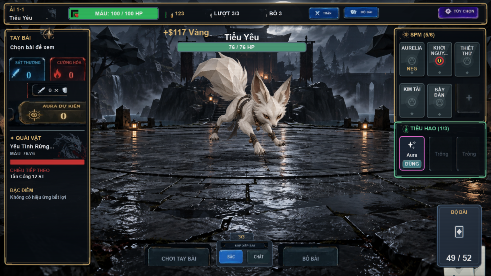
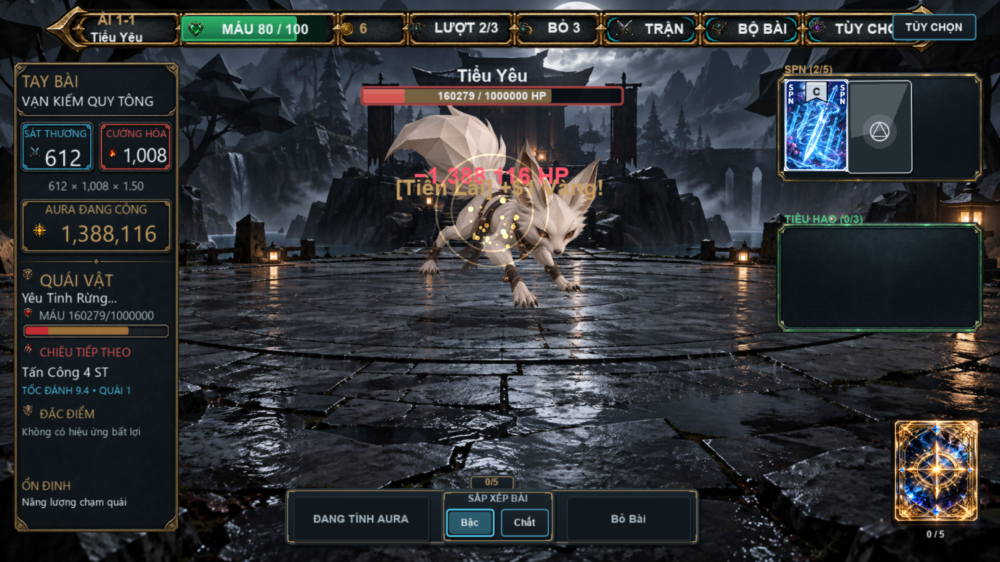
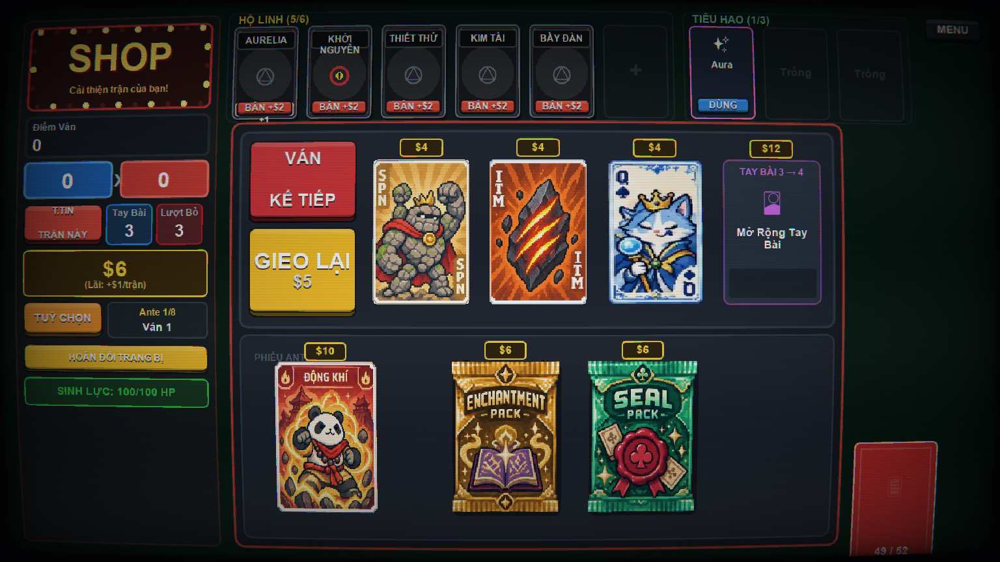
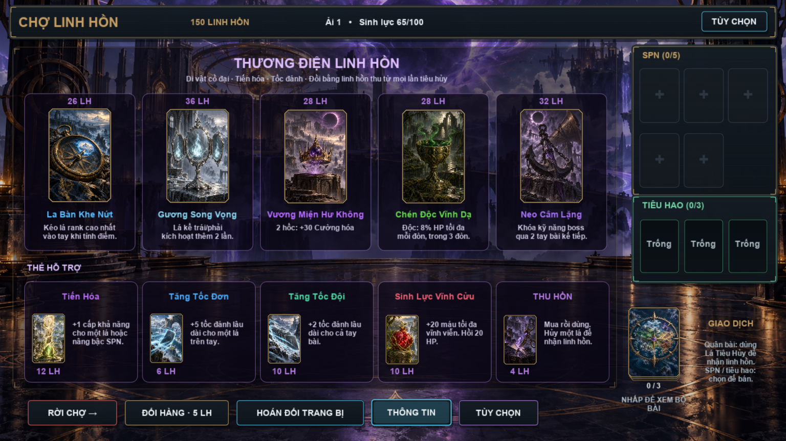
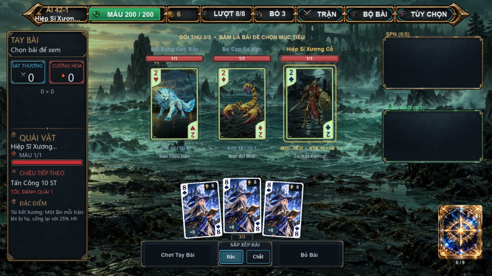
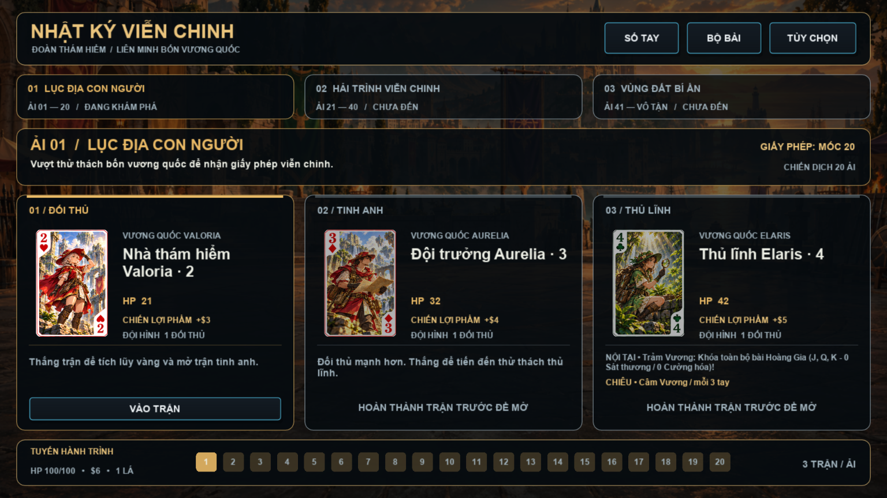
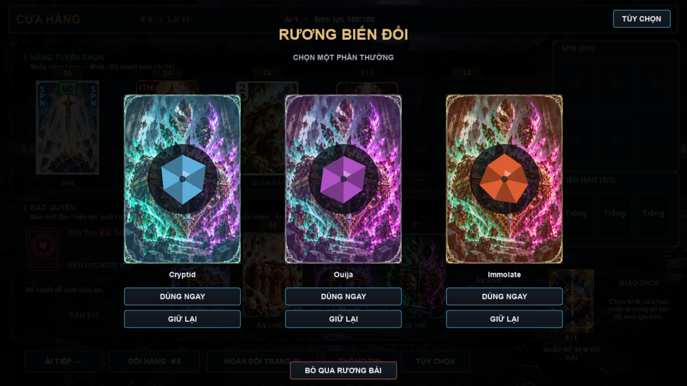
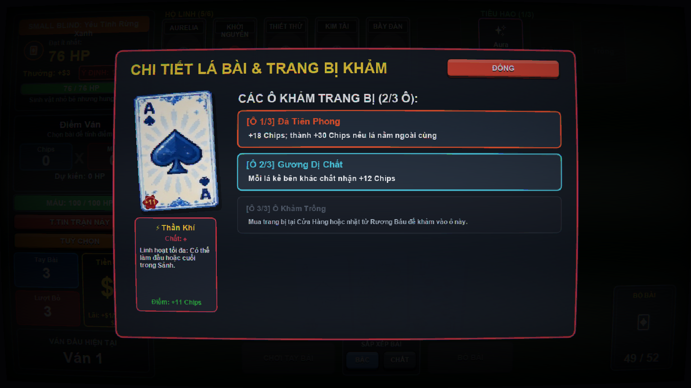
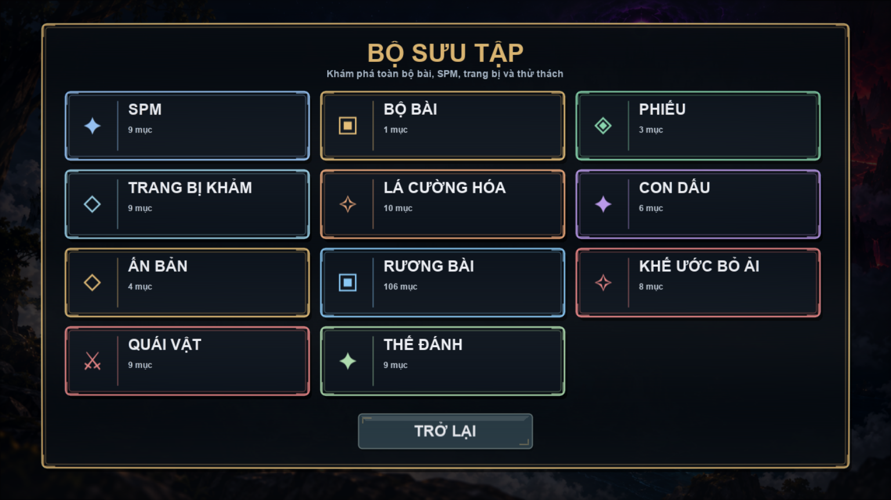
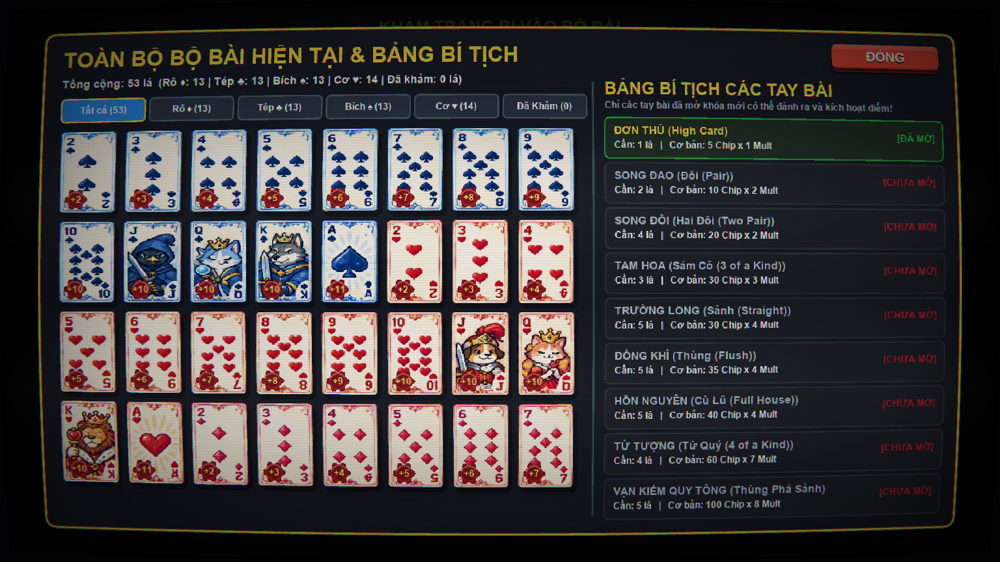

# 🃏 LUA.TCG — GRIMDARK POKER ROGUELIKE DECKBUILDER

> **Phiên bản hiện tại: v0.75.3**  
> Một tựa game thẻ bài chiến thuật kết hợp độc đáo giữa cơ chế tính điểm bùng nổ của **Poker Roguelike (Balatro)**, chiến đấu theo lượt đối kháng trực diện với quái vật phong cách **Slay the Spire**, đồ họa nghệ thuật **Dark Fantasy / HD-2D** và hệ thống kinh tế - tiến trình sâu sắc.
> 
> Toàn bộ trò chơi được xây dựng 100% bằng **Lua thuần túy** và vận hành mượt mà trên engine **LÖVE 2D (Love2D v11.5)**.

[](https://github.com/UIBreaker/Lua.TCG.git)
[](https://love2d.org/)
[](https://www.lua.org/)
[-orange)](#)
[](test_system.lua)
[](LICENSE)

---

## 📸 Hình Ảnh Trực Quan (Gameplay Showcase)

### ⚔️ Chiến Đấu & Hiệu Ứng Bùng Nổ Điểm Số
| Giao Diện Chiến Đấu Đỉnh Cao | Bùng Nổ Điểm Số & Đòn Đánh |
| :---: | :---: |
|  |  |
| *Giao diện Grimdark: Hiển thị Intent quái, HP/Armor, thanh Hộ Mệnh SPN và ô Tiêu Hao* | *Hiệu ứng tính điểm Chips × Mult × XMult với camera shake và đòn đánh trực quan* |

### 🛒 Chợ Lữ Khách & Chợ Linh Hồn (Soul Bazaar)
| Cửa Hàng & Mở Gói Booster | Chợ Linh Hồn Bí Ẩn (Soul Bazaar) |
| :---: | :---: |
|  |  |
| *Cửa hàng truyền thống: Thẻ bài, Trang bị, Voucher đặc quyền & Reroll linh hoạt* | *Khu chợ ma thuật bóng tối: Đổi Soul Shards lấy cổ vật di chúc và thần hộ mệnh độc quyền* |

### 👥 Đội Hình Quái Vật & Chế Độ Viễn Chinh (Expedition)
| Đội Hình Kẻ Địch Đa Dạng | Chọn Lựa Chuyến Viễn Chinh |
| :---: | :---: |
|  |  |
| *Đối đầu với các nhóm quân địch: Quái thú hoang dã, lính đánh thuê và thủ lĩnh Boss* | *Lựa chọn lộ trình viễn chinh với Giấy Thông Hành, địa hình bờ biển và hải trình tàu chiến* |

### 🎴 Thần Hộ Mệnh, Rương Cổ & Soi Chi Tiết Bài
| Mở Khóa Rương Cổ & Thẻ Bài | Soi Chi Tiết & 3 Hốc Khảm Bảo Ngọc |
| :---: | :---: |
|  |  |
| *Hiệu ứng lật thẻ rương báu huyền bí và lựa chọn bổ sung sức mạnh* | *Chuột phải soi chi tiết cấp bậc, chất bài, dòng mô tả và 3 hốc khảm đá quý* |

### 📖 Bộ Sưu Tập Toàn Thư (Compendium) & Xem Toàn Bộ Bộ Bài (Tab)
| Bộ Sưu Tập Toàn Thư | Bảng Quản Lý Bộ Bài [Tab] |
| :---: | :---: |
|  |  |
| *Toàn thư tra cứu Thần Hộ Mệnh, Trang Bị, Bí Tịch Thế Bài, Phù Chú & Dị Biến* | *Theo dõi tỷ lệ 4 chất bài, thẻ đã cường hóa/khảm ngọc và rút gọn theo thời gian thực* |

---

## 🌟 Các Tính Năng Nổi Bật (Phiên Bản 0.75.3)

### 1. 🃏 Cơ Chế Đánh Bài & Tính Điểm Đột Phá
- **Cơ chế tính điểm 3 tầng:** $\text{Điểm Sát Thương} = \text{Chips} \times \text{Mult} \times \text{XMult}$.
- **9 Thế bài Poker kinh điển:** Từ Mậu Thầu (High Card) đến Thùng Phá Sảnh (Straight Flush), nâng cấp level qua Thẻ Hành Tinh (Planet Cards).
- **Hệ thống điều khiển linh hoạt:** Nhấp chọn từng lá, **giữ chuột rê ngang/chéo (Drag-to-select)** để chọn nhanh nhiều lá, và `Shift + Kéo` để sắp xếp bài tự do.
- **Hiệu ứng thẻ bài sống động:** Đổ bóng 3D Card Tilt, phản quang Holographic, Foil lấp lánh, Polychrome đa sắc và hiệu ứng tan biến (Dissolve).

### 2. 🛡️ 4 Đại Phe Phái & Thứ Bậc Quân Vụ
- **♠️ Thiết Quân Thứ (The Iron Axiom):** Chỉ số thép, lá bài tạo Giáp (Armor) hấp thụ sát thương, miễn nhiễm hiệu ứng xấu của Boss, thế trận Phalanx.
- **♥️ Giáo Hội Huyết Ước (The Sanguine Covenant):** Tăng vọt hệ số Mult, Dấu Ấn Tử Đạo, Ma Huyết cường hóa và hồi phục sinh lực khi cận kề nguy hiểm.
- **♦️ Trật Tự Hoàng Kim (The Gilded Conclave):** Kinh tế vượt trội, Kim Ngân tích lũy vàng qua mỗi lá đánh ra, trần lãi suất cao và khả năng hối lộ kẻ địch.
- **♣️ Bầy Nguyên Sinh (The Feral Swarm):** Mở rộng giới hạn tay bài lên 9 lá, cho phép hoàn thành Sảnh và Thùng chỉ với 4 lá bài.

### 3. 🕊️ Thần Hộ Mệnh (SPN / Deities & Spirits)
- Tối đa **5 – 6+ ô Thần Hộ Mệnh** đồng hành cùng người chơi.
- **Kéo thả sắp xếp thứ tự:** Kích hoạt từ Trái sang Phải, cho phép bạn tối ưu chuỗi nhân sát thương (+Mult đi trước ×Mult).
- **Hệ thống Tiến Hóa Hộ Mệnh (Evolution Picker):** Nâng cấp linh thú thành các thực thể tối cao mang sức mạnh thay đổi cục diện trận đấu.

### 4. 💎 Khảm Nén Bảo Ngọc (Equipment & Socketing)
- Mỗi quân bài trong bộ bài sở hữu **3 Hốc Khảm Bảo Ngọc (Socketing Slots)**.
- Gắn kết các trang bị độc dị: *Gương Dị Chất* (khuếch đại bài liền kề), *Đá Tam Kích*, *Nhẫn Liều Mạng*, *Xúc Tác Hư Không*, *Đồng Tiền May Mắn*...
- Trang bị cao cấp thu thập từ **Chợ Linh Hồn (Soul Relics)** mang lại năng lực định hình phong cách chơi.

### 5. 💀 Đối Kháng Kẻ Địch & Cơ Chế Roguelike Chân Thực
- **Vòng lặp 8 Ante:** Mỗi Ante gồm Small Blind, Big Blind và Boss Blind với các lời nguyền cấm kỵ (The Needle, The Water, The Hook, The Arm...).
- **Đội hình kẻ địch (Enemy Formations):** Quái vật tác chiến đơn lẻ hoặc theo bầy đàn với Intent (Ý định hành động) minh bạch, đòi hỏi tính toán phòng thủ bằng Giáp cẩn trọng.
- **Hiệu ứng kết liễu đa dạng (Death VFX):** Kẻ địch tan vỡ thành mảnh pha lê, hóa tro tàn bụi mờ hoặc gục ngã trước những combo sát thương khổng lồ.
- **Khế ước Bỏ Ải (Skip Blind):** Đổi lấy Huy Hiệu Tài Nguyên quý giá nếu bạn dám mạo hiểm bỏ qua màn đánh thường.

### 6. 🌌 Đồ Họa HD-2D & Thời Tiết Động
- Không gian giao diện Grimdark chuẩn **1920×1080** (tự động co giãn sắc nét trên mọi màn hình 1600×900, 1366×768).
- **Hệ thống thời tiết động (Weather System):** Mưa rào, Bão tuyết, Cực quang huyền ảo, Tro tàn lơ lửng, Đom đóm đêm và Mưa sao băng thay đổi theo từng sàn đấu.
- Thiết kế khung viền Gothic, biểu tượng sắc sảo, mô tả chi tiết thẻ bài hỗ trợ tiếng Việt trọn vẹn và an toàn UTF-8.

---

## 🎮 Hướng Dẫn Điều Khiển (Controls)

| Thao Tác | Phím / Chuột | Tác Dụng |
| :--- | :--- | :--- |
| **Chọn / Bỏ chọn bài** | `Chuột trái` | Nhấp vào lá bài để chọn hoặc bỏ chọn |
| **Chọn nhiều lá nhanh** | `Giữ chuột trái & Rê` | Rê ngang/chéo qua các lá bài để chọn liên tục |
| **Đổi vị trí lá bài** | `Shift + Kéo chuột` | Giữ Shift và kéo lá bài sang vị trí mong muốn |
| **Sắp xếp Thần Hộ Mệnh**| `Kéo & Thả (Drag & Drop)`| Đổi chỗ các ô Thần Bài trên thanh trên cùng |
| **Soi chi tiết bài** | `Chuột phải` | Mở bảng thông tin sâu về quân chủng, hốc khảm |
| **Xem toàn bộ bộ bài** | Phím `Tab` | Mở giao diện thống kê phân bố bài & tỷ lệ |
| **Chơi bài** | Nút `CHƠI TAY BÀI` | Đánh ra bộ bài đã chọn để tính điểm và tấn công |
| **Bỏ bài** | Nút `BỎ BÀI` | Bỏ các lá đã chọn và rút bài mới thay thế |
| **Tạm dừng / Cài đặt** | Phím `Escape` (`Esc`) | Mở menu tạm dừng, tùy chỉnh âm lượng & đồ họa |

---

## 🚀 Cài Đặt & Trải Nghiệm (Getting Started)

### Yêu Cầu Hệ Thống
- Hệ điều hành: Windows 10/11, macOS, hoặc Linux.
- Đã cài đặt [LÖVE 2D (v11.5)](https://love2d.org/).

### Khởi Chạy Trò Chơi
1. **Clone repository:**
   ```bash
   git clone https://github.com/UIBreaker/Lua.TCG.git
   cd Lua.TCG
   ```
2. **Chạy game qua Love2D:**
   ```bash
   # Nếu love đã được thêm vào PATH:
   love .

   # Hoặc trên Windows với đường dẫn trực tiếp:
   "C:\Path\To\love.exe" .
   ```

### Chạy Bộ Kiểm Thử Tự Động (Automated Tests)
Game tích hợp sẵn bộ kiểm thử toán học, logic game và giao diện toàn diện:
```bash
# Kiểm tra toàn bộ hệ thống gameplay & mechanics
love . --test

# Kiểm tra thuật toán nhận diện thế bài Poker & tính điểm
love . --test-poker

# Kiểm tra các tính năng nâng cao & phe phái
love . --test-features
```

---

## 📁 Cấu Trúc Dự Án (Project Structure)

```text
├── assets/                  # Toàn bộ tài nguyên âm thanh, hình ảnh thẻ bài, UI Gothic & thời tiết
│   ├── cards/               # Bộ 52 lá bài cổ điển & phong cách lục địa (Continental)
│   ├── deities/             # Ảnh thần hộ mệnh (SPN), linh thú minh họa & pixel art
│   ├── equipment/           # Ảnh trang bị khảm ngọc (ITM) & Soul Relics
│   ├── packs/               # 7 loại gói thẻ bài Booster phong cách Dark Fantasy
│   ├── scene/               # Cảnh nền đấu trường, quái vật & chợ linh hồn
│   └── ui/                  # Nút bấm 3D, thanh HUD, crests, badges và khung viền gothic
├── config/                  # Các file cấu hình chỉ số, loot drop, thời tiết & VFX
├── docs/                    # Tài liệu đặc tả hệ thống, Art Bible & hình ảnh minh họa
├── render/                  # Bộ dựng hình HD-2D, camera, ánh sáng, post-processing & thời tiết
├── shaders/                 # Bộ shader GLSL (Foil, Holographic, Dissolve, Depth, Ash...)
├── src/                     # Mã nguồn logic cốt lõi (Combat, Deck, Shop, Scoring, Souls...)
├── tests/                   # Các script kiểm thử tự động, smoke test & capture hồi quy
├── ui/                      # Các thành phần giao diện người dùng (Components, Panels, Layout)
├── main.lua                 # Điểm khởi chạy chính của trò chơi (LÖVE loop)
└── conf.lua                 # Cấu hình cửa sổ, đồ họa & âm thanh LÖVE2D
```

---

## 📜 Bản Quyền & Giấy Phép (License)

Dự án được phân phối dưới giấy phép mã nguồn mở **[MIT License](LICENSE)**. Bạn có quyền tự do sử dụng, tùy biến và phát triển tiếp theo các điều khoản của giấy phép.

*Chúc bạn có những trải nghiệm nặn bài kịch tính, kết hợp combo Thần Binh bùng nổ và chinh phục thành công cả 8 Ante của LUA.TCG!*
