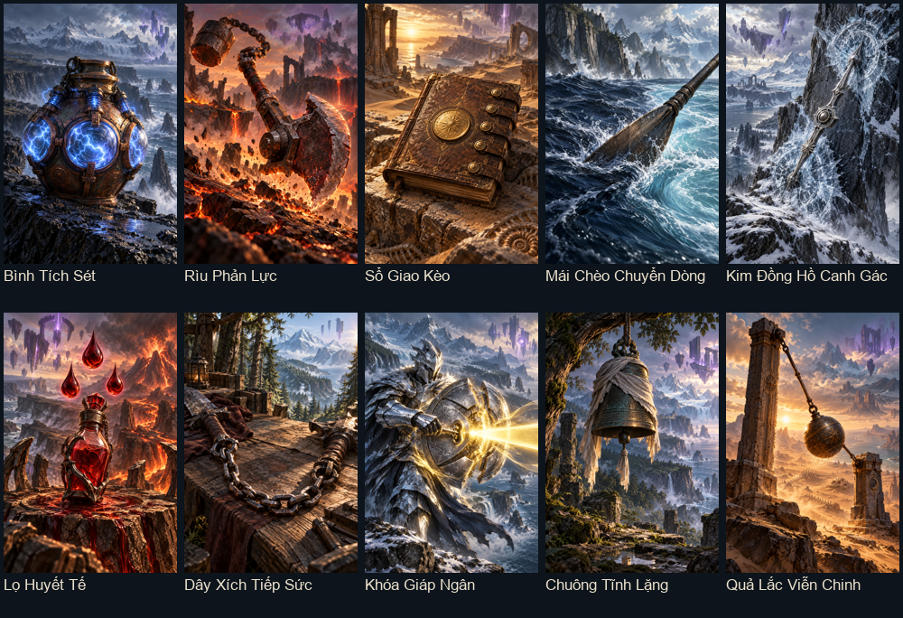
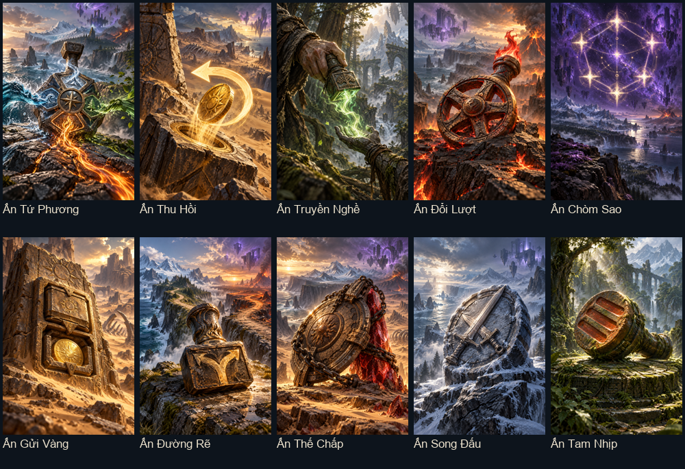
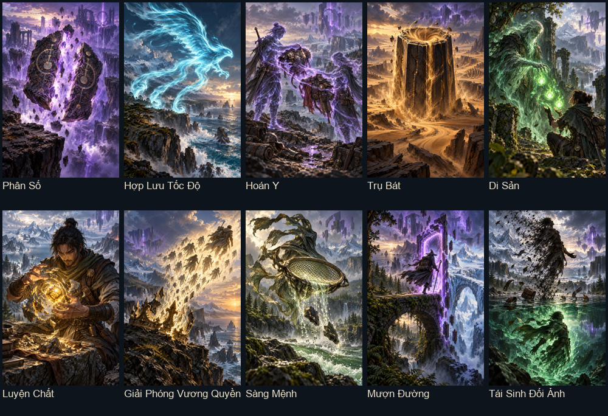
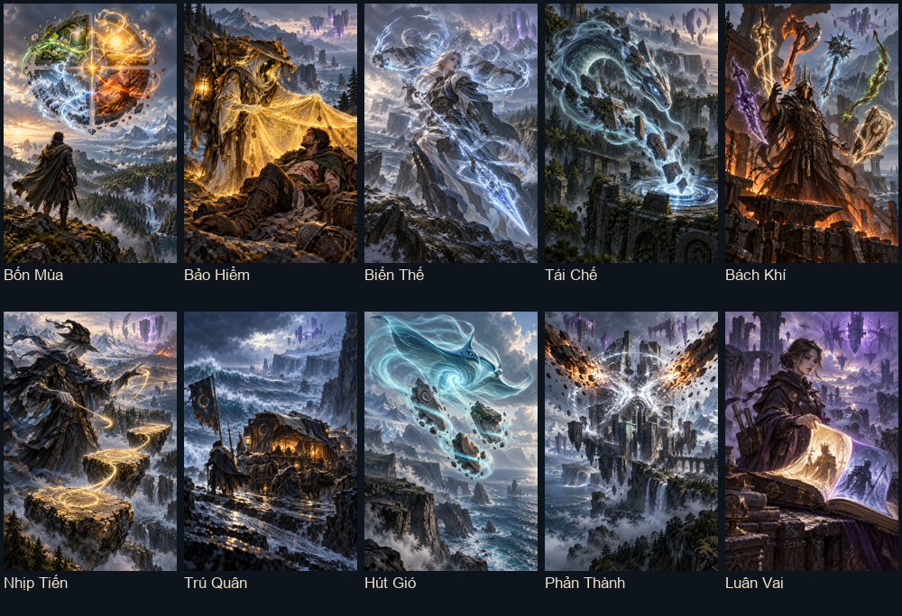

# Đợt hai: 40 lá chiến thuật mới

Thêm 10 lá cho mỗi rương, giữ toàn bộ lá cũ. Tổng danh mục hiện tại: **29 trang bị, 26 con dấu, 28 biến đổi, 24 phù phép SPN**.

Bộ này tập trung chuẩn bị nhiều lượt, đổi tài nguyên có chi phí, mạng lưới dấu, luân phiên thế đánh và tái cấu trúc bộ bài. Điện, giọt máu, nhịp, bộ ghi và giới hạn một lần đều mất khi kết thúc trận; đầu tư, tiến hóa và biến đổi bộ bài được lưu lâu dài. Phù phép mới thay phù phép cũ trên SPN đầu tiên theo vị trí ô, giữ ấn bản/tiến hóa.

## Một vài hướng phối hợp

- **Chuẩn bị bằng bỏ bài:** Bình Tích Sét + Lọ Huyết Tế + Ấn Gửi Vàng tích lực, đổi lại tiêu lượt, HP và vàng trước khi xả.
- **Phòng thủ phản công:** Kim Đồng Hồ Canh Gác + Phản Thành + Trú Quân thưởng giữ bài qua các đòn quái; Khóa Giáp Ngân cho quyết định dùng giáp để sống hay gây sát thương.
- **Luân phiên thế đánh:** Chuyển Dòng + Quả Lắc + Biến Thế + Bốn Mùa; có lý do đổi giữa Đôi, Sảnh và kích thước tay thay vì đánh một combo suốt trận.
- **Mạng lưới con dấu:** Tứ Phương cần bỏ nhiều lá mang dấu thuộc đủ 4 chất; Chòm Sao tăng sức mạnh theo số lá cùng dấu trong bộ bài.
- **Tập trung hoặc phân phối nâng cấp:** Hợp Lưu Tốc Độ, Hoán Y, Di Sản và Tái Sinh Đối Ảnh đều có chi phí hoặc phần nâng cấp phải hy sinh.

## Trang bị

| Lá | Khả năng |
|---|---|
| Bình Tích Sét | Bỏ lá này: tích 1 điện, tối đa 3. Khi tính điểm: xả toàn bộ, mỗi điện +20 ST và +2 Cường hóa. Điện mất khi hết trận. |
| Rìu Phản Lực | Tính điểm sau khi bị quái gây mất HP từ lần đánh trước: +1% sát thương mỗi HP mất, tối đa 30%; không tính HP tự trả. |
| Sổ Giao Kèo | Khi tính điểm: tự trả 1 Vàng để đầu tư 1 nấc, tối đa 5 nấc vĩnh viễn trên lá. Mỗi nấc cho +2 Cường hóa, kể cả khi không đủ Vàng. |
| Mái Chèo Chuyển Dòng | Khi tính điểm trong thế đánh khác lần đánh trước của trận: +20 ST và +4 Giáp. Không kích hoạt ở tay đầu. |
| Kim Đồng Hồ Canh Gác | Giữ lá này qua 2 đòn quái: lần tính điểm sau nhận +12 Cường hóa và xóa số đòn đã giữ; chỉ tính đòn quái thực sự ra tay. |
| Lọ Huyết Tế | Bỏ lá này khi còn hơn 2 HP: trả 2 HP, tích 1 giọt (tối đa 3). Khi tính điểm: xả giọt, mỗi giọt +5 Cường hóa. Mất giọt khi hết trận. |
| Dây Xích Tiếp Sức | Nếu lá tính điểm ngay trước có trang bị: nhận thêm ST bằng một nửa ST cơ bản của lá trước (làm tròn xuống), tối đa 60. |
| Khóa Giáp Ngân | Khi tính điểm và đang có ít nhất 8 Giáp: tiêu 8 Giáp để +20% sát thương. Giáp đã tiêu không chặn đòn quái sau đó. |
| Chuông Tĩnh Lặng | Mỗi lần lá tính điểm mà chưa bỏ bài từ lần đánh trước: tích 1 nhịp (tối đa 4), +3 Cường hóa mỗi nhịp. Bất kỳ lần bỏ bài nào xóa nhịp của mọi lá mang chuông. |
| Quả Lắc Viễn Chinh | So với số lá tính điểm ở tay trước: đánh nhiều hơn thì +24 ST; đánh ít hơn thì +6 Giáp. Bằng nhau hoặc tay đầu không có thưởng. |

## Con dấu

| Lá | Khả năng |
|---|---|
| Ấn Tứ Phương | Các lá mang ấn cùng ghi chất mỗi khi bị bỏ. Đủ 4 chất đã ghi chung: lá mang ấn tính điểm kế tiếp +0.6 hệ số Aura rồi xóa bộ ghi. Ký ức chỉ giữ trong trận. |
| Ấn Thu Hồi | Bỏ riêng lá này: trả 2 Vàng để hoàn 1 lượt bỏ bài, tối đa một lần mỗi trận. Thiếu Vàng không trả chi phí và không hoàn lượt. |
| Ấn Truyền Nghề | Khi tính điểm: lá ngay sau trong vùng tính điểm nhận +1 cấp khả năng tạm thời trong trận (tối đa trần tiến hóa). Không tự nâng bản thân. |
| Ấn Đổi Lượt | Tính điểm cùng đúng 5 lá: trả 4 HP để nhận +1 lượt đánh, một lần mỗi trận; chỉ trả khi còn hơn 4 HP. |
| Ấn Chòm Sao | Khi tính điểm: +8 ST mỗi lá khác trong bộ bài vĩnh viễn đang mang Ấn Chòm Sao, tối đa +48. Khuyến khích xây mạng lưới dấu thay vì chỉ một lá mạnh. |
| Ấn Gửi Vàng | Bỏ lá này: gửi 1 Vàng vào ấn (tối đa 3 Vàng mỗi trận). Khi tính điểm: nhận lại gấp đôi số đã gửi rồi xóa khoản gửi. |
| Ấn Đường Rẽ | Lá này tính điểm trong hai thế đánh khác nhau liên tiếp của chính nó: hoàn 1 lượt bỏ bài, tối đa một lần mỗi trận. Không cần đánh liên tiếp hai tay. |
| Ấn Thế Chấp | Khi tính điểm: nếu còn lượt bỏ bài, tiêu 1 lượt để nhận 15 Giáp; nếu hết lượt bỏ bài, trả 3 HP để nhận +9 Cường hóa (cần hơn 3 HP). |
| Ấn Song Đấu | Chỉ một lá tính điểm và đúng một lá giữ lại: +2% sát thương mỗi bậc rank chênh giữa hai lá, tối đa 24%. |
| Ấn Tam Nhịp | Mỗi lần lá tính điểm tích một nhịp. Cứ lần thứ ba: hồi 8 HP và xóa nhịp. Nhịp mất khi hết trận; tái kích hoạt không thêm nhịp. |

## Biến đổi

| Lá | Khả năng |
|---|---|
| Phân Số | Chọn lá rank ít nhất 6: chia rank của nó thành hai phần gần bằng nhau, đổi rank lá chọn và lá khác đầu tiên trên tay theo hai phần đó. Trả 3 Vàng; giữ chất và nâng cấp. |
| Hợp Lưu Tốc Độ | Chọn một lá: chuyển tối đa 12 tốc đánh thưởng từ các lá khác trên tay sang lá chọn, theo trái sang phải. Trả 4 Vàng; chỉ dùng khi có tốc thưởng và không mất do trần 999. |
| Hoán Y | Hoán đổi toàn bộ trang bị và cường hóa giữa lá chọn và lá khác đầu tiên trên tay. Rank, chất, con dấu, ấn bản và tiến hóa giữ nguyên; trả 2 Vàng. |
| Trụ Bát | Chọn lá có ấn bản: xóa ấn bản, đổi rank thành 8 và nhận vĩnh viễn +20 ST cơ bản; giữ chất, dấu, trang bị và tiến hóa. |
| Di Sản | Chuyển tối đa 3 cấp tiến hóa vĩnh viễn từ lá khác đã tiến hóa đầu tiên trên tay sang lá chọn; không vượt trần. Trả 3 HP, cần hơn 3 HP. |
| Luyện Chất | Chọn lá có cường hóa: xóa cường hóa để nhận vĩnh viễn +25 ST cơ bản; không xóa trang bị, dấu, ấn bản hay tiến hóa. |
| Giải Phóng Vương Quyền | Tiêu hủy lá J/Q/K được chọn để tăng vĩnh viễn 1 kích thước tay; giảm 10 HP tối đa (tối thiểu còn 25), HP hiện tại không vượt trần mới. Không dùng với lá cuối bộ bài. |
| Sàng Mệnh | Chọn một lá: tiêu hủy tối đa 2 lá khác chất có rank thấp nhất trong bộ bài, thêm vĩnh viễn 1 lượt bỏ bài mỗi trận. Trả 8 Vàng; phải có ít nhất một mục tiêu hủy. |
| Mượn Đường | Chọn một lá: nhận rank của lá thấp rank nhất khác trên tay và chất của lá cao rank nhất khác trên tay. Hòa rank chọn trái nhất; trả 2 Vàng, giữ mọi nâng cấp. |
| Tái Sinh Đối Ảnh | Tiêu hủy lá chọn, tạo lá mới cùng chất với rank 16 trừ rank cũ và tiến hóa +1 cấp (tối đa trần). Lá mới mất toàn bộ trang bị, dấu, cường hóa, ấn bản và tốc thưởng; ID mới. |

## Phù phép SPN

| Lá | Khả năng |
|---|---|
| Phù Phép Bốn Mùa | SPN đầu tiên: ghi các thế đánh đã dùng. Đủ 4 thế khác nhau trong trận thì thêm 1 lượt đánh và xóa bộ ghi. Mỗi tay chỉ ghi một lần. Thay phù phép cũ; giữ ấn bản/tiến hóa. |
| Phù Phép Bảo Hiểm | SPN đầu tiên: mỗi tay nhận 1 Vàng cho mỗi 5 HP thực sự bị quái lấy từ lần đánh trước, tối đa 3 Vàng; tự trả HP không được bồi thường. Thay phù phép cũ; giữ ấn bản/tiến hóa. |
| Phù Phép Biến Thế | SPN đầu tiên: chuyển từ Đôi/Hai Đôi sang Sảnh hoặc ngược lại giữa hai tay liên tiếp: +0.45 hệ số Aura. Thùng Phá Sảnh cũng tính là Sảnh. Thay phù phép cũ; giữ ấn bản/tiến hóa. |
| Phù Phép Tái Chế | SPN đầu tiên: khi đánh mà cọc rút đã hết, nhận 1 lượt bỏ bài, một lần mỗi trận; không tự xáo cọc hoặc rút thêm bài. Thay phù phép cũ; giữ ấn bản/tiến hóa. |
| Phù Phép Bách Khí | SPN đầu tiên: mỗi loại trang bị khác nhau trên các lá tính điểm cho +2 Cường hóa, tối đa +12; trang bị trùng ID chỉ tính một lần. Thay phù phép cũ; giữ ấn bản/tiến hóa. |
| Phù Phép Nhịp Tiến | SPN đầu tiên: tay trước tính điểm 2 lá, tay này 3 lá: lá thấp rank nhất giữ lại nhận +1 cấp khả năng tạm thời trong trận; hòa rank chọn lá trái nhất. Thay phù phép cũ; giữ ấn bản/tiến hóa. |
| Phù Phép Trú Quân | SPN đầu tiên: tích số đòn quái thực sự ra tay trong trận. Sau mỗi 3 đòn, tay đánh kế tiếp hồi 10 HP rồi xóa 3 đòn; tối đa một lần mỗi tay. Thay phù phép cũ; giữ ấn bản/tiến hóa. |
| Phù Phép Hút Gió | SPN đầu tiên: bỏ đúng 3 lá có rank khác nhau thì mọi lá còn giữ trên tay nhận +2 tốc đánh tạm trong trận (tối đa 999). Có thể kích hoạt nhiều lần. Thay phù phép cũ; giữ ấn bản/tiến hóa. |
| Phù Phép Phản Thành | SPN đầu tiên: mỗi đòn quái bị Giáp chặn hết từ lần đánh trước cho +40 ST ở tay kế tiếp, tối đa +80; đòn Boss hủy trước khi ra tay không tính. Thay phù phép cũ; giữ ấn bản/tiến hóa. |
| Phù Phép Luân Vai | SPN đầu tiên: chuyển giữa vùng tính điểm toàn J/Q/K và toàn quân số 2–10: tăng vĩnh viễn 1 cấp của thế đánh mới, một lần mỗi trận; áp dụng từ tay sau. Thay phù phép cũ; giữ ấn bản/tiến hóa. |

## Kiểm tra

``lua tests/chest_depth_smoke.lua``: chuỗi nhiều lượt, bỏ bài, quái tấn công, chi phí, điều kiện, cất/dùng, xem trước không đổi trận thật, lưu game, reset bộ đếm, ngẫu nhiên rương.

``love . --test-chest-expansion``: LuaJIT và render cả hai bộ 80 lá qua loader/khung thật.

