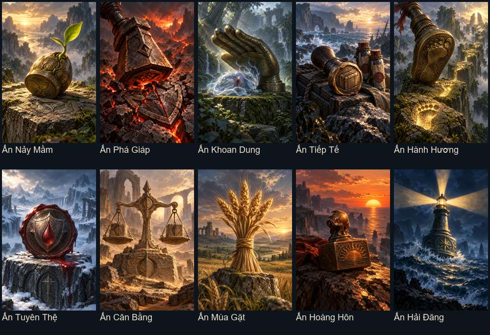
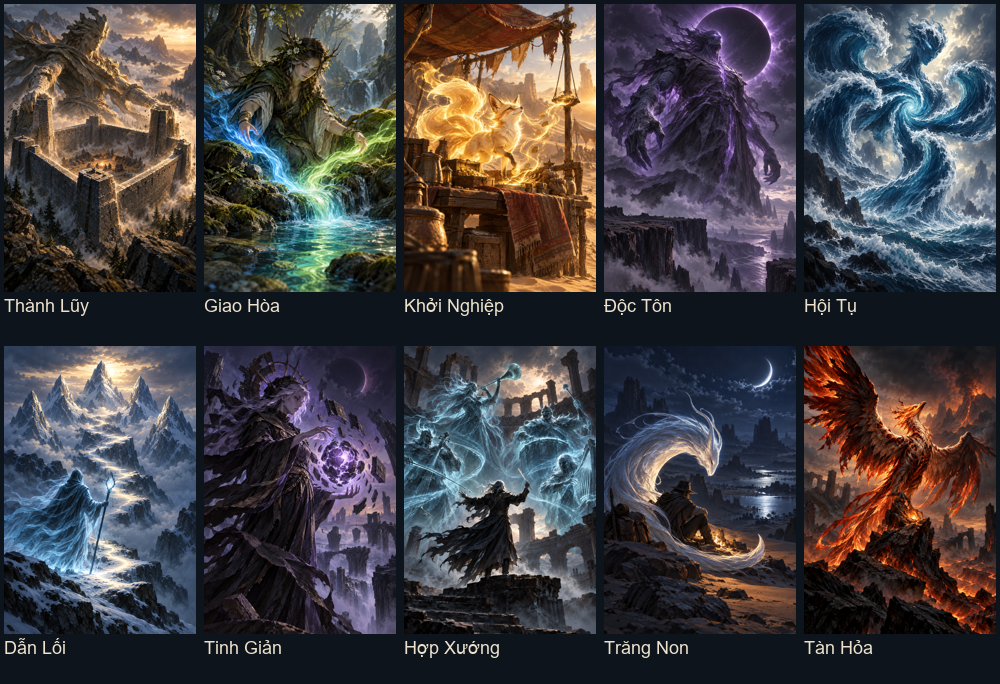
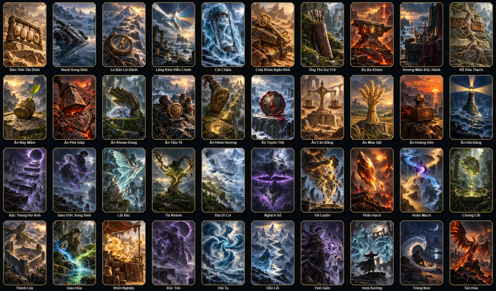

# 40 lá mới cho bốn rương

Mỗi rương thêm 10 lá, giữ các lá cũ. Trang bị: 19; con dấu: 16; biến đổi: 18; phù phép SPN: 14.

Biến đổi và dấu dùng lá được chọn, hoặc lá đầu tay/bộ bài nếu chưa chọn. Phù phép mới áp dụng lên SPN đầu tiên theo vị trí ô; mỗi SPN giữ một phù phép, thay phù phép cũ và giữ ấn bản/tiến hóa. Có thể cất phép và dấu để dùng sau. Thiếu điều kiện không mất lá tiêu hao.

## Trang bị

| Lá | Khả năng |
|---|---|
| Bàn Tính Tân Binh | Rank 2–5 tính điểm: +8 ST cho mỗi bậc thấp hơn 6. |
| Nanh Song Sinh | Có đúng một lá khác cùng rank tính điểm: +0.25 hệ số Aura (cộng vào trần ×5). |
| La Bàn Lữ Hành | Lá tính điểm ngay trước lệch đúng 1 rank: +7 Cường hóa. |
| Lăng Kính Viễn Chinh | Vùng tính điểm có ít nhất 3 chất: +35 ST. |
| Cát Chậm | Tốc đánh lá này thấp hơn quái mục tiêu: +9 Giáp khi tính điểm. |
| Chìa Khóa Ngân Khố | Mỗi 8 Vàng đang giữ: +1 Cường hóa khi tính điểm, tối đa +8. |
| Ống Tên Dự Trữ | Mỗi lá giữ lại trên tay: +6 ST khi tính điểm, tối đa +36. |
| Đe Ba Khảm | Lá đã dùng đủ 3 hốc trang bị: +12% sát thương khi tính điểm. |
| Vương Miện Độc Hành | Nếu lá này là J/Q/K duy nhất tính điểm: +12 ST và +1 Vàng. |
| Rễ Hóa Thạch | Mỗi cấp tiến hóa của lá này: +10 ST khi tính điểm, tối đa +50. |

## Con dấu

| Lá | Khả năng |
|---|---|
| Ấn Nảy Mầm | Mỗi lần tính điểm: tăng vĩnh viễn 2 ST cơ bản, tối đa +20 từ ấn này; có hiệu lực từ lần sau. |
| Ấn Phá Giáp | Khi tính điểm: phá 8 Giáp của quái mục tiêu trước khi gây Aura, không xuống dưới 0. |
| Ấn Khoan Dung | Quái mục tiêu còn tối đa 25% HP khi tính điểm: hồi 6 HP. |
| Ấn Tiếp Tế | Giữ ít nhất 2 tiêu hao khi tính điểm: +1 Vàng. |
| Ấn Hành Hương | Mỗi lá khác đã tiến hóa trong vùng tính điểm: +2 Cường hóa, tối đa +8. |
| Ấn Tuyên Thệ | HP ít nhất 75% tối đa khi tính điểm: trả 2 HP để nhận 10 Giáp. |
| Ấn Cân Bằng | Vùng tính điểm có số lá rank chẵn và lẻ bằng nhau: +30 ST. |
| Ấn Mùa Gặt | Đúng 5 lá tính điểm đều là rank 2–10: +2 Vàng. |
| Ấn Hoàng Hôn | Khi còn tối đa 1 lượt đánh: +20% sát thương khi tính điểm. |
| Ấn Hải Đăng | Mỗi lá cùng rank giữ lại trên tay: +20 ST khi tính điểm, tối đa +60. |

## Biến đổi

| Lá | Khả năng |
|---|---|
| Bậc Thang Hư Ảnh | Chọn một lá: đổi tối đa 4 lá khác trên tay thành rank kế tiếp của nó (không vượt A), lần lượt theo thứ tự tay. Trả 4 HP. |
| Giao Ước Song Sinh | Chọn một lá: lá khác đầu tiên trên tay nhận cùng rank, giữ chất và mọi nâng cấp. Trả 3 Vàng. |
| Lột Xác | Chọn một lá đã tiến hóa: mất 1 cấp tiến hóa, nhận vĩnh viễn +8 tốc đánh (tối đa 999). |
| Tỉa Nhánh | Chọn một lá: tiêu hủy tối đa 2 lá khác cùng rank trong bộ bài; lá chọn nhận +10 ST cơ bản mỗi lá hủy. Luôn giữ ít nhất 1 lá. |
| Đại Di Cư | Chọn một lá: mọi lá cùng rank trong bộ bài đổi sang chất tiếp theo trong vòng Cơ–Rô–Chuồn–Bích. Trả 4 Vàng. |
| Nghịch Số | Chọn một lá: đổi rank thành 16 trừ rank hiện tại (2↔A, 3↔K, 8 giữ nguyên); trả 2 HP. |
| Tôi Luyện | Chọn một lá có trang bị: tháo trang bị cuối cùng, đổi lấy 2 cấp tiến hóa vĩnh viễn. Không dùng nếu vượt trần tiến hóa. |
| Phân Hạch | Chọn một lá rank 4–A: giảm rank đi 2, thêm một lá rank 2 cùng chất vào bộ bài; lá mới không mang nâng cấp. |
| Hoán Mạch | Chọn một lá: hoán đổi chất với lá khác đầu tiên trên tay có chất khác, giữ nguyên rank và nâng cấp. |
| Chưng Cất | Chọn một lá có con dấu: xóa dấu, nhận vĩnh viễn +1 cấp tiến hóa và +4 tốc đánh. Không dùng ở trần tiến hóa. |

## Phù phép SPN

| Lá | Khả năng |
|---|---|
| Phù Phép Thành Lũy | SPN đầu tiên nhận Thành Lũy: vùng tính điểm có ít nhất 4 lá thì +8 Giáp mỗi tay. |
| Phù Phép Giao Hòa | SPN đầu tiên nhận Giao Hòa: vùng tính điểm có đúng 2 chất thì hồi 4 HP mỗi tay. |
| Phù Phép Khởi Nghiệp | SPN đầu tiên nhận Khởi Nghiệp: khi giữ dưới 10 Vàng thì nhận 2 Vàng mỗi tay. |
| Phù Phép Độc Tôn | SPN đầu tiên nhận Độc Tôn: nếu chỉ sở hữu 1 SPN thì +0.4 hệ số Aura mỗi tay (cộng vào trần ×5). |
| Phù Phép Hội Tụ | SPN đầu tiên nhận Hội Tụ: khi đánh Thùng hoặc Thùng Phá Sảnh, +10 Cường hóa mỗi tay. |
| Phù Phép Dẫn Lối | SPN đầu tiên nhận Dẫn Lối: Sảnh hoặc Thùng Phá Sảnh nhận +60 ST mỗi tay. |
| Phù Phép Tinh Giản | SPN đầu tiên nhận Tinh Giản: bộ bài vĩnh viễn còn tối đa 15 lá thì +10 Cường hóa mỗi tay. |
| Phù Phép Hợp Xướng | SPN đầu tiên nhận Hợp Xướng: mỗi SPN khác đang sở hữu cho +12 ST mỗi tay, tối đa +48. |
| Phù Phép Trăng Non | SPN đầu tiên nhận Trăng Non: đánh đúng 1 lá rank 2–7 thì +0.35 hệ số Aura mỗi tay (cộng vào trần ×5). |
| Phù Phép Tàn Hỏa | SPN đầu tiên nhận Tàn Hỏa: HP còn tối đa 25% thì +25% sát thương và hồi 2 HP mỗi tay. |

Kiểm tra: `lua tests/chest_expansion_smoke.lua`. 40 PNG riêng 1024×1536, không chữ/khung; prompt và nguồn sinh ảnh trong `chest_expansion_generation.json`.

## Kiểm tra trong LÖVE

Chạy `love . --test-chest-expansion` để kiểm tra LuaJIT, dùng/cất tiêu hao, lưu game và render cả 40 lá qua loader cùng khung chung.

